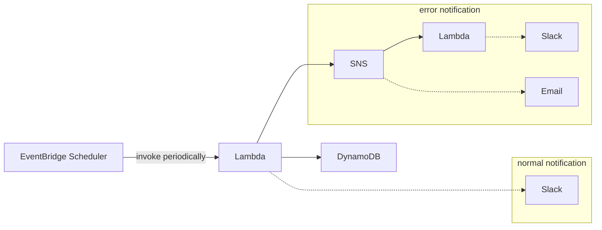

# learn-terraform-aws

https://developer.hashicorp.com/terraform/tutorials/aws-get-started

## Command

```sh
# initialize
terraform init

# format and validate
terraform fmt -recursive
terraform validate

# check plan and apply
terraform plan
terraform apply
terraform apply -auto-approve
terraform apply -target=module.ec2_app

# apply with variables
terraform apply -var "instance_name=yet-another-server-instance"

# show state
terraform show

# show only outputs
terraform output

# destroy
terraform destroy

# invoke lambda function (sync)
aws lambda invoke --function-name example-lambda-app --cli-binary-format raw-in-base64-out response.json

# invoke lambda function (async, the same as EventBridge cron)
aws lambda invoke --function-name example-lambda-app --invocation-type Event --cli-binary-format raw-in-base64-out response.json
```

## Example Architecture



## Note

- roleにpolicyをattachする方法
    - aws_iam_roleのinline_policyで参照
        - 通常はinline_policyの利用は非推奨
        - https://qiita.com/yoshi65/items/fe8483df3de8f31cba3c
    - aws_iam_roleのmanaged_policy_arnsで参照
        - resourceの作成完了を待って、そのresourceへのpolicyをattachすることはできない
        - https://itport.cloud/?p=19156
    - aws_iam_policy_attachmentでattach
        - 指定したpolicyの独占的な管理を行うため、他の場所でpolicyを別途attachはできない
    - aws_iam_role_policy_attachmentでattach
        - roleにpolicyを1対1で個別にattachできる
- variablesとlocalsの使い分け
    - モジュール内に閉じた変数は基本的にlocalsとする
    - モジュール外部から渡される変数はvariablesとする
    - https://qiita.com/hajimeni/items/4afcac38e4f275edb852
- 次の通知構成はChatbotがLambdaからの通知に未対応のため利用できない
    - EventBridge -> Lambda -> SNS -> Chatbot -> Slack
- `aws lambda invoke`のsyncモードの制約
    - CrowdWatchへログは書き込まれない
    - SNSはトリガーされない
        - エラー通知のEmailやSlackは送信されない
